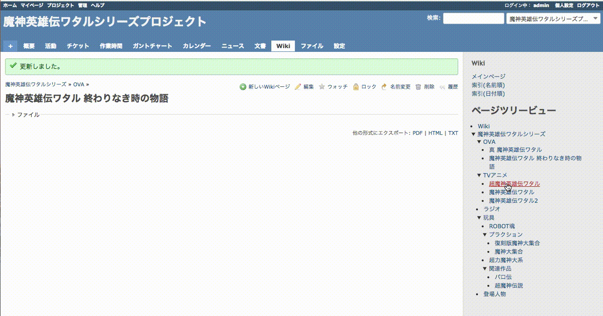

# Redmine Wiki Page Tree Plugin

This plugin makes a page tree view in the sidebar.
And you can edit parent-child relationship of wiki pages by drag & drop.

## Screenshot



## Installation
1. Clone or copy files into the Redmine plugins directory
  ```
  git clone https://github.com/ledsun/redmine_wiki_page_tree.git plugins/redmine_wiki_page_tree
  ```
2. Restart Redmine

## License
This plugin is released under the MIT License.
